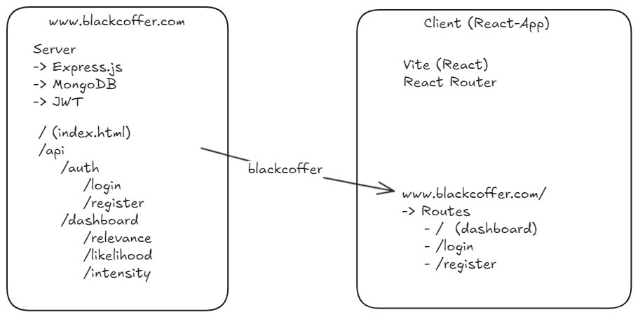

<div align="center">
  
</div>

# Blackcoffer

A data visualization web app.

## Demo

[Video](https://drive.google.com/file/d/1wHBaM-xBrEPpO4UwQZ0fKMyLKFi3-54r/view?usp=sharing)

## Architecture



## How to run?

### Build React App

```bash
cd client
npm install
npm run build

# Development??
npm run dev
```

### Database Setup

- Create a database with the name `blackcoffer`
- Create a collection with the name `trends`
- Create a collection with the name `userinfo`
- Import the json data from `docs/jsondata.json` into `trends` collection


### Backend Server

Setup environment variable

```env
JWT_SESSION_SECRET=
```

```bash
cd server
npm install
npm start

# Development??
npm run dev
```


